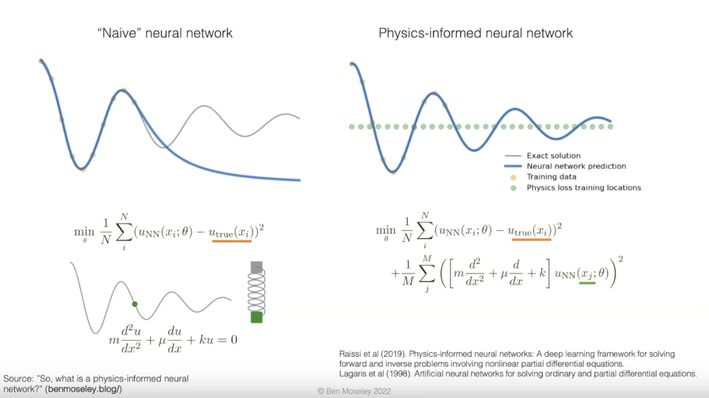
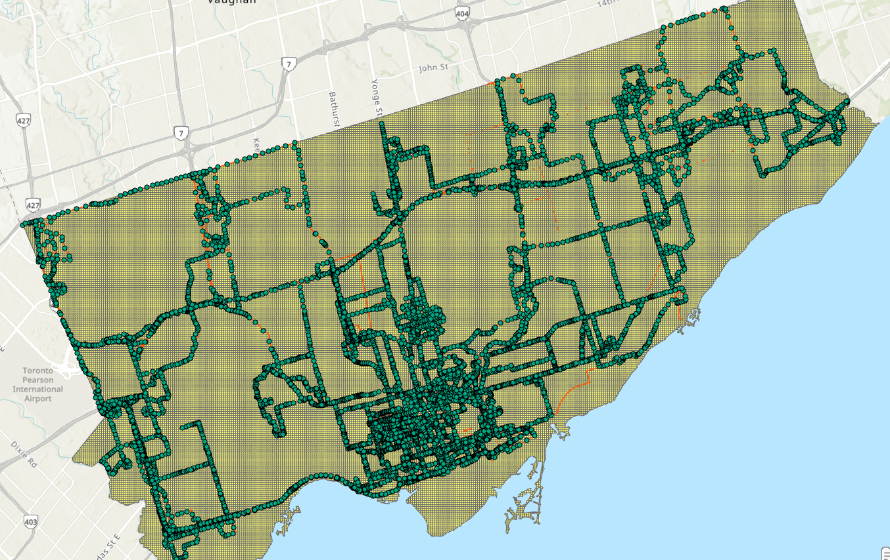
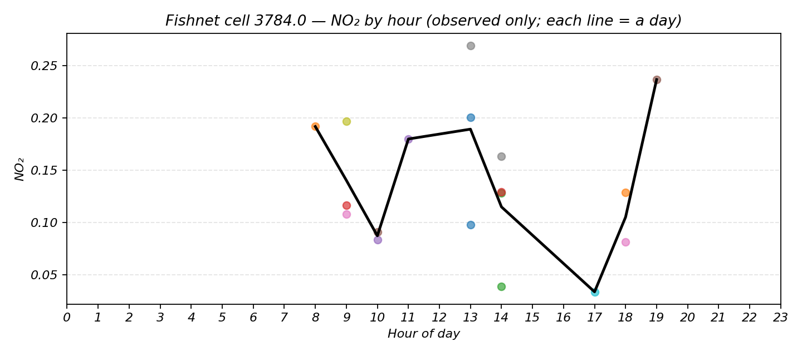
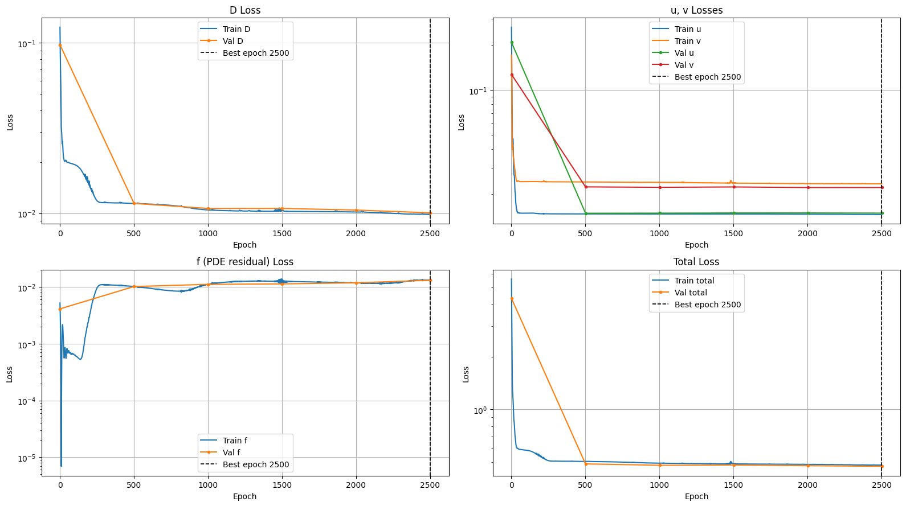
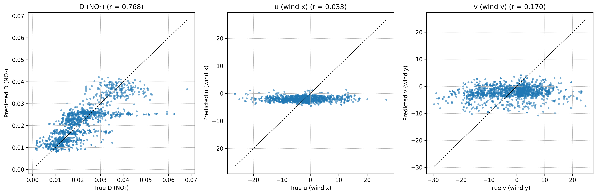
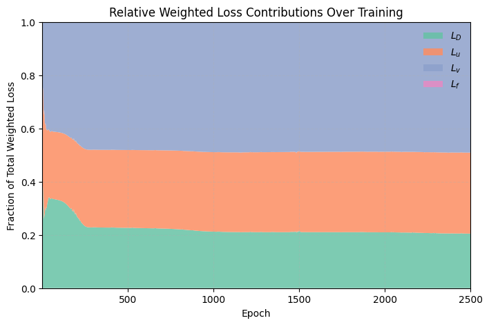

# CIM_UrbanScanner
University of Toronto Cities in Motion: Student Hackathon

## Project Structure

The project is currently organized as so:

```
CIM_UrbanScanner
├── data
│   ├── datareadme.md
│   ├── DroveOn100mRoad (folder)
│   ├── fishnet (folder)
│   ├── GIS_predictors (folder)
│   ├── r3File_Merge1.csv (wind speed data)
│   └── zipped (zipped, original data downloads)
├── data.py (data input/output and preprocessing)
├── LICENSE
├── notebooks
│   └── data_analysis.ipynb
├── README.md
└── requirements.txt
```

The data folder contains the project data in the exact folder structure provided. Python files at the top level will be the main working documents, and the notebooks folder contains jupyter notebooks for personal use and data exploration.

### Physics-Informed Neural Networks (PINNs)

The paper “Phy-APMR: A Physics-Informed Air Pollution Map Reconstruction Approach with Mobile Crowd-Sensing for Fine-Grained Measurement” by Shi et al. introduces a hybrid framework that integrates physical pollution diffusion models with neural networks to reconstruct detailed urban air pollution maps from sparse, mobile sensor data. By embedding physics-based constraints and using an adaptive collocation sampling method, the model improves both accuracy and computational efficiency compared to purely data-driven approaches. We can apply this concept to our project by incorporating the model architecture, and improved upon the PDE formulation the authors originally proposed.

A Physics-Informed Neural Network (PINN) is a type of neural network that incorporates known physical laws, typically in the form of partial differential equations (PDEs), directly into the training objective. Rather than relying entirely on supervised data, PINNs use these governing equations to constrain the model and guide learning in regions where data may be sparse or noisy.



In this project, we use a PINN to model the spread of nitrogen dioxide ($\text{NO}_2$) in an urban area using the convection-diffusion equation. This PDE captures both the diffusive behavior of the pollutant and its transport due to wind fields. The network is trained to predict pollution concentration and wind velocities across space and time, while minimizing both data discrepancy and the residual of the convection-diffusion equation. This allows the model to interpolate physical behavior and maintain consistency with the underlying dynamics of air pollution transport.

### Convection-Diffusion Equation of Air Pollution Propogation

We can model the diffusion of $\text{NO}_2$ using air propogation dynamics using the convection-diffusion equation, a more advanced form of the diffusion equation considering the influence of bulk velocity:

$$
\frac{\partial D(\overrightarrow{r}, t)}{\partial t} = \nabla\cdot\big[K(D,\overrightarrow{r})\nabla~D(\overrightarrow{r},t)\big]-\nabla\cdot\big[\overrightarrow{v}(\overrightarrow{r},t)D(\overrightarrow{r},t)\big]+S(\overrightarrow{r},t)
$$

Where:
- $D$ is the concentration of $\text{NO}_2$ in parts per million (PPM)
- $K$ is the coefficient of diffusion
- $\overrightarrow{r}$ is a location within the urban area in meters
- $t$ is the time in hours
- $\overrightarrow{v}$ is windspeed in meters per second
- $S$ is a source emission of $\text{NO}_2$ in PPM per second

We can train a neural network (NN) which outputs three observable air and environmental quantities: $\hat{D}(\cdot;\theta)$, $\hat{u}(\cdot;\theta)$, and $\hat{v}(\cdot;\theta)$; predicted pollution concentration, x-direction wind speed, and y-direction wind-speed respectively. Accordingly, there are three loss components $L_D(\theta)$, $L_u(\theta)$, and $L_v(\theta)$ that measures data discrepancy loss.

Decomposing $\overrightarrow{r}$ into its x and y components and making the assumption that the coefficient of diffusion $K$ is constant, we can obtain a partial derivative equation (PDE) residual function to obtain the physical loss discrepancy:

$$
\hat{f}(x,y,t) := K(\hat{D}''_{xx}(x,y,t;\theta)+\hat{D}''_{yy}(x,y,t;\theta))
\\
-\hat{D}(x,y,t;\theta)(\hat{u}'_x(x,y,t;\theta)+\hat{v}'_y(x,y,t;\theta))
\\
-\hat{u}(x,y,t;\theta)\hat{D}'_x(x,y,t\theta)-\hat{v}(x,y,t;\theta)\hat{D}'_y(x,y,t;\theta)
\\
+\hat{S}(x,y,t;\theta)-\hat{D}'_t(x,y,t;\theta)
$$

Where $\lambda_D, \lambda_u, \lambda_v, \lambda_f$ are hyperparameters that balance the data and physical loss components.

Which is trained on the collocation (virtual) training set $T_f = \{(x^i_f, y^i_f, t^i_f, )|i=1,2,3,\ldots,N_f\}$ to form the physical discrepancy loss $\mathcal{L_f}(\theta)$. Convsersely, the data discrepancy loss is trained on $T_D = \{(x^i_D, y^i_D, t^D_f,D^i_D, S^i_D, u^i_D, v^i_D)|i=1,2,3,\ldots,N_D\}$. Combining the above data and physical discrepancy, the complete loss function, utilizing mean square error (MSE), is:

$$
\mathcal{L}(\theta) = \lambda_D(\theta) + \lambda_u\mathcal{u}(\theta) + \lambda_v\mathcal{v}(\theta) + \lambda_f\mathcal{f}(\theta) \\
= \frac{\lambda_D}{N_D}\sum_{i=1}^{N_D} \left| \hat{D}(x_D^i, y_D^i, t_D^i; \theta) - D_D^i \right|^2 \\
+ \frac{\lambda_u}{N_D}\sum_{i=1}^{N_D} \left| u(x_D^i, y_D^i, t_D^i; \theta) - u_D^i \right|^2 \\
+ \frac{\lambda_v}{N_D}\sum_{i=1}^{N_D} \left| \hat{v}(x_D^i, y_D^i, t_D^i; \theta) - v_D^i \right|^2 \\
+ \frac{\lambda_f}{N_f}\sum_{i=1}^{N_f} \left| \hat{f}(x_f^i, y_f^i, t_f^i; \theta) \right|^2
$$

## Implementation Details

The input to the model is comprised of a training set $T_D$ and collocation training set $T_f$. For $T_D$, the variables, their descriptions, and requisite data sources are summarized in the table below:

| Variable | Unit | Description | Source |
|-|-|-|-|
| $x,y$ | meter | Physical location | `fishnet.shp` |
|$t$|hour|Timestep| `r3File_Merge1.csv` |
$D$ | PPM | $\text{NO}_2$ concentration | `r3File_Merge1.csv`
| $S$ | PPM/hour | Source $\text{NO}_2$ concentration per sec | `Traffic_Road_Segments.shp` and `DroveOn100mRoad.shp` |
| $u,v$ | meter/sec | wind speed in x-y components | `r3File_Merge1.csv`|
|

For the collocation training set $T_f$, we randomly sample 1000 collocation points from the `fishnet.shp`


## Source Emission Concentration

To obtain the spatially and temporally resolved source emission term S(x,y,t) for nitrogen dioxide (NO₂), the raw mobile sensing data were first processed and mapped onto the spatial analysis grid. The original reading dataset contained instantaneous NO₂ readings associated with latitude–longitude coordinates of sensours which reads emission concentarion  and timestamps. These readings were projected into the same coordinate reference system as the 100×100 m fishnet grid and spatially joined so that each measurement was assigned to the grid cell in which it occurred. The timestamp of each observation was decomposed into a date and an hourly component to enable temporal aggregation. Within each cell and day, multiple measurements recorded during the same hour were combined into a single hourly value, representing the total (or mean) NO₂ concentration for that spatial–temporal unit. This procedure produced a dataset of observed hourly NO₂ concentrations for every grid cell and day covered by the mobile campaign.



Because the sensor platform did not collect readings continuously across all hours, many grid cells had gaps in their hourly coverage. To reconstruct a continuous diurnal pattern while avoiding unrealistic extrapolation, we performed a cell-wise temporal interpolation constrained to the observed hour window of each cell. Specifically, for each grid cell the earliest and latest observed hours were identified, and linear interpolation was applied only within this interval to fill missing intermediate hours. Hours lying outside the observed range were left undefined. This approach preserved the integrity of the measured data while yielding a smooth and physically plausible hourly emission profile consistent with the temporal extent of actual observations. The interpolated hourly averages were then treated as the zone-level emission field S(x,y,t). The resulting tables serve as the spatiotemporal source input for the Physics-Informed Neural Network model that estimates and constrains pollutant dynamics through the convection–diffusion equation residual.



## Modeling Results

Below is a summary of the trained models input data, preprocessing methods and statistics, hyperparameters, and model architecture.

```
Contents:
  D_true         : tensor (1479, 1)
  u_true         : tensor (1479, 1)
  v_true         : tensor (1479, 1)
  D_pred         : tensor (1479, 1)
  u_pred         : tensor (1479, 1)
  v_pred         : tensor (1479, 1)
=== Pollution Data Summary ===
Total rows: 2,957
Columns: ['r3_key', 'x_meter', 'y_meter', 'hour', 'NO2', 'wind_x', 'wind_y', 'S']

Feature ranges (original scale):
  x_meter    min=293725.476  max=335018.683  mean=313422.626
  y_meter    min=4827214.793  max=4856777.060  mean=4842647.635
  hour       min=     9.467  max=    19.017  mean=    12.102
  NO2        min=     0.001  max=     0.068  mean=     0.022
  wind_x     min=   -26.531  max=    26.750  mean=    -2.050
  wind_y     min=   -30.736  max=    30.390  mean=    -2.164
  S          min=     0.000  max=     0.000  mean=     0.000

Preprocessed:
  Train samples: 1,478
  Test samples:  1,479
  Collocation pts: 10,000
  Scaling: on
  Device: mps

--- Verbose Info ---
Tensor shapes:
  xyt   : (1478, 3)
  D     : (1478, 1)
  u     : (1478, 1)
  v     : (1478, 1)
  S     : (1478, 1)

Scaled input ranges:
  x-scaled  min=  0.0023  max=  0.9837
  y-scaled  min=  0.0194  max=  0.9900
  t-scaled  min=  0.0000  max=  1.0000

Original output feature min/max:
  D  : min=  0.0014, max=  0.0683
  u  : min=-26.5307, max= 26.7501
  v  : min=-30.7360, max= 30.3896

Scaled S range:
  S-scaled  min=  0.0000  max=  0.0000
==============================
```


The total and component losses demonstrate clear convergence behavior, with most of the reduction occurring within the first 500 epochs. While the model successfully minimized data losses for NO₂, the residual PDE term remained stable, reflecting that the physical regularization was well enforced. However, validation losses for the wind components (u, v) remained higher, implying that the model captured pollutant dynamics more effectively than the underlying wind field variability.



The predictions for wind components u and v showed very low correlations (r = 0.033 and r = 0.170), with outputs clustering around zero. This indicates that the model struggled to represent the variability of horizontal wind motion, likely due to limited meteorological input features or insufficient coupling between the physical and data-driven components.



Some insight into the performance of the model is the contribution of concentration loss, D, wind losses u and v, and physical PDE residual $\hat{f}$. The physics informs the model, not enforces it, so the right balance between lossess is critical for model performance.



## Limitations
- Model failed to capture a realistic wind field representation of the model area. This can most likely be attributed to three factors; (1) lack of hyperparameter tuning, (2) Exclusion of boundary conditons along analysis area edge, (3) Incorrect conversions between ML "model space" and "physical space" when computing the Convection-Diffusion equation.
- Static assumptions for coefficient of diffusion, no ground effects from terrain or buildings, did not take into account humidity or pressure.
- No boundary conditions along edge of analysis area. Without boundary conditions, data points at the edge of the model are free to take on arbitrary values, typically those most conducive to smooth, laminar flow.

## Contributions
- The second application of PINN model at the regional/city scale utilizing mobile pollution sensor data.`
- Improvement on the Phy-APMR framework by including source emmission effects excluded in the original formulation.

## Future work
Future work will focus on:
- Incorporating boundary and initial conditions explicitly within the PDE formulation.
- Introducing spatially variable diffusion coefficients to better capture local turbulence.
- Expanding the dataset to include meteorological and topographic predictors such as temperature, humidity, and surface roughness.
- Performing hyperparameter optimization and ablation studies to improve stability and convergence.

